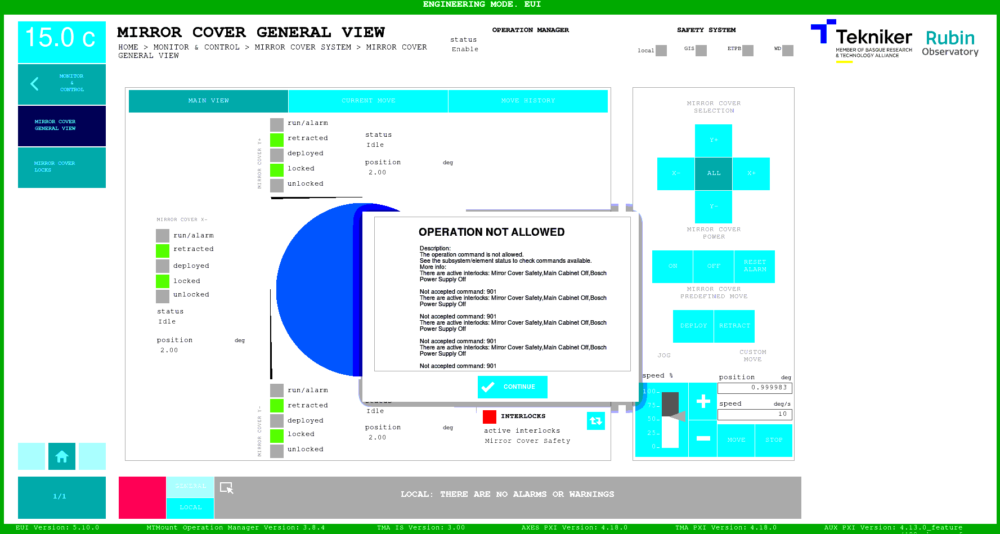
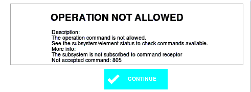
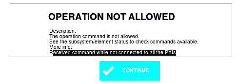
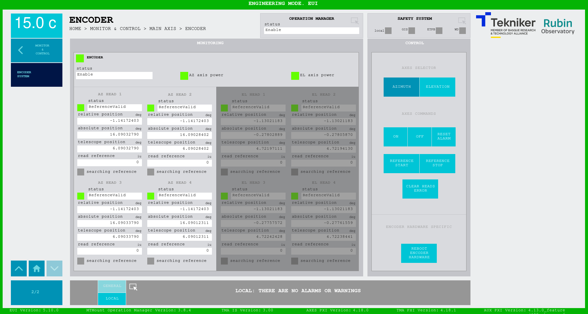
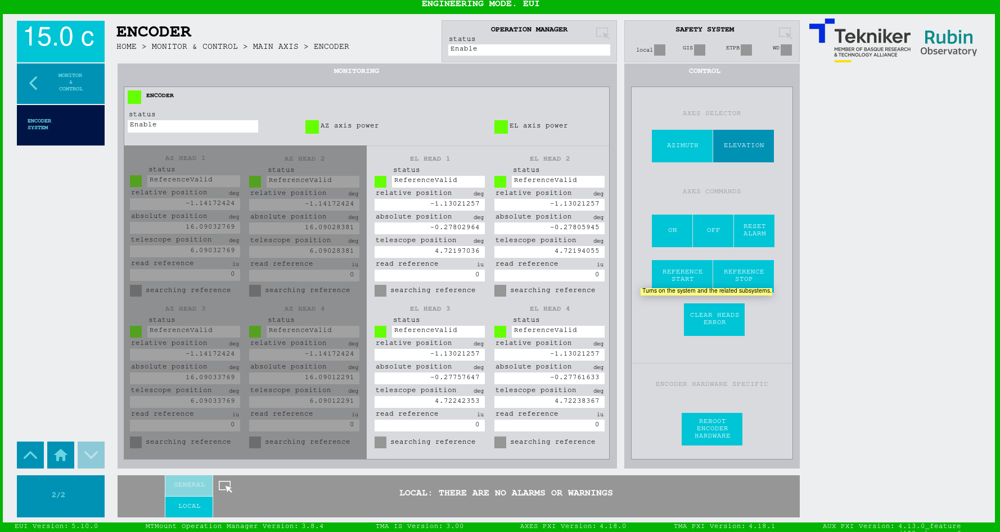
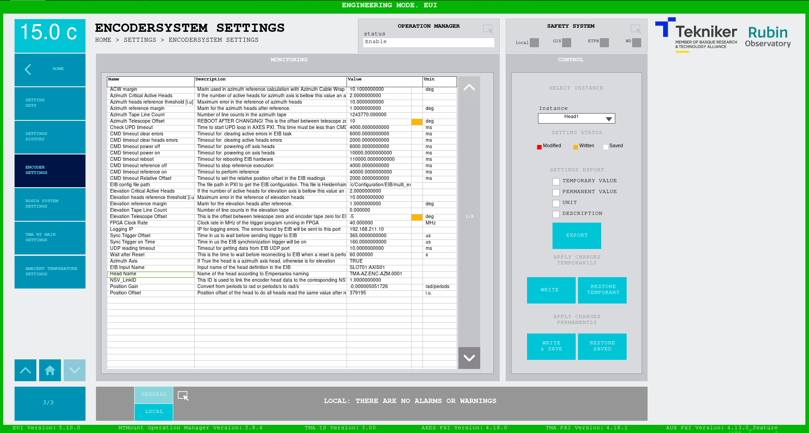

# Training September-October 2023

## Hardware

Hardware slides can be found [**here**](https://github.com/lsst-ts/ts_tma_tma-documentation_training/blob/master/slides/2023-September-October/Training_Hardware_compressed.pdf)

The aim of this section is locating and explaining main hardware elements in the telescope.

Main hardware elements:

- OSS
  - Location
  - Purpose:
    - Pressurized oil supply (bearings and brake oil supply)
  - Additional:
    - Distributed control cabinets with temperature control (we provide just the setpoint)
  - How does it works from EUI, and what it can and can't do
- Pier cabinet
  - Location
  - Explain the elements that are wired here
    - All the fixed elements below AZ (not rotating)
- ACW
  - Location
  - How it works and what it can do.
    - HW Limits and location
    - How to get out of the HW limits
    - What to check if the position of the ACW is very wrong for some reason
      - Fix: power on AZ, do home, and the system will fail when ACW will try to go to the "wrong" position
- Capacitor bank cabinets (Not Tekniker, limited knowledge)
  - Location
  - Capacitor 8 Cabinets
  - Charging cabinet
  - Power distribution cabinets
  - Indicators
- Azimuth drives
  - Explain location and how they work (we provide torque setpoint through ethercat)
  - Temperature control
- Azimuth limit switches and topple block
  - Location and how they work
- Azimuth encoder tape and heads
  - Explain location and how they work
  - Wired to EIB
- Elevation drives
  - Explain location and how they work
  - Temperature control
- Elevation encoder tape and heads
  - Explain location and how they work
  - Wired to EIB
- Elevation limit switches
  - Location and how they work (all range and operational AZ doesn't have this)
- Main azimuth cabinet (AZ-0001)
  - Location
  - Temperature control
  - Contents:
    - PXIs
    - Bosch controller and drives (ACW and CCW), the rest are distributed in the motors
    - Safety controller, totally independent from the MCS control, main target **PROTECT PEOPLE** (equipment damage is converted to people damage)
    - Ethercat devices, two lines:
      - I/Os
      - Drives
    - EIB (there is just 1 for both AZ and EL)
    - RMC
    - Ethernet connections
- Azimuth cabinet 0101
  - Location
  - Temperature control
  - Contents:
    - IOs
    - Safety IOs
- Main power supply (Not Tekniker, limited knowledge)
  - Location
  - Temperature control
  - How does it works from EUI, and what it can and can't do

  ```{uml}
  @startuml
  agent acLine
  agent powerSupply
  agent capacitorBank
  agent AZdrives
  agent ELdrives
  interface "DC bus" as 1
  interface "DC bus" as 2
  interface "DC bus" as 3

  acLine <-> powerSupply
  powerSupply <-> 1: DC bus
  1 <-d-> capacitorBank
  1 <-> 2: DC bus
  2 <-d-> AZdrives
  2 <-> 3: DC bus
  3 <-d-> ELdrives
  @enduml
  ```

- Locking pins
  - Location
  - Use
  - Limits, which indicate position in the EUI but are also wired to the safety system
- Deployable platforms
  - Location
  - Use
  - Limits, which indicate position in the EUI but are also wired to the safety system
  - How to request permission to extend platforms from the EUI, as the locks are managed by the Safety PLC (PILZ)
- Mirror cover (with locks)
  - Location
  - Use
  - Limits, which indicate position in the EUI
  - Manual disable switch for maintenance
- Elevation cabinets inside CST
  - Location
  - Contents:
    - IOs
    - Safety IOs
- Balancing
  - Location
  - Use
  - Limits
- Auxiliary boxes (temp control)(Not Tekniker, limited knowledge)
  - Location
  - Temperature control
- TEC if ready
  - Location
- CCW if ready
  - Location
  - Use
  - Limits, deviation and range limits

## Software

Software slides can be found [**here**](https://github.com/lsst-ts/ts_tma_tma-documentation_training/blob/master/slides/2023-September-October/Training_Software.pdf)

Before starting with this section, is **important** to review these two files:

- [**MCS Operation**](https://github.com/lsst-ts/ts_tma_tma-documentation_mcs-operation/blob/master/MCS_Operation.md)
- [**MCS SW Design Report**](https://github.com/lsst-ts/ts_tma_tma-documentation_mcs-sw-design/blob/master/MCS_SW_Design_Report.md)

### Hardware Configuration tools

- EIB configuration tool
  - There is some documentation on how to change the IP [here](https://github.com/lsst-ts/ts_tma_tma-documentation_maintenance-documents_eib_eib-change-ip)
  useful as a start point.
- Bosch configuration tool 3 docs:
  - [**Bosch_Controller_Startup_Configuration**](https://github.com/lsst-ts/ts_tma_tma-documentation_maintenance-documents_bosch-controller_bosch-controller-startup-configurati): This repo contains the document for the startup of the Bosch Controller (MLC) and its configuration.
  - [**BoschRexrothRecovery**](https://github.com/lsst-ts/ts_tma_tma-documentation_maintenance-documents_bosch-controller_bosch-rexroth-recovery): This repo has the documentation to recover the Bosch Rexroth hardware from a stuck situation or a major fault.
  - [**ReplaceBoschMotor**](https://github.com/lsst-ts/ts_tma_tma-documentation_maintenance-documents_bosch-controller_replace-bosch-motor): Documentation with procedure to replace a Bosch motor and configure it. In this document there are no mechanical instructions for the replacement.
- TwinCAT, for [ethercat diagnosis](https://github.com/lsst-ts/ts_tma_tma-documentation_maintenance-documents_ethercat_ethercat-line-diagnostic)
- NI distributed system manager: manages the ethercat from the PXIs, this tool comes from National Instruments and can only run on windows
  - Check signals from the remote IOs, e.g. that the bosch power supply is on
- EZ-Zone Configurator: for the temperature controller in the AZ-0001 cabinet. Backup config file
  [here](https://github.com/lsst-ts/ts_tma_hardware-configurations_watlow-configuration)
- Startup+: for the ethercat modules in all 5 cabinets, AZ-0001, AZ-0101, EL-0101, EL-0102 and PI-0001. This configuration
  must be done locally using a micro usb cable. The backup configuration files are saved
  [here](https://github.com/lsst-ts/ts_tma_labview_pxi-controller/tree/develop/ESIFiles/Phoenix/IOConfiguration)

### PAS4000

This is the tool used to code the PILZ safety controllers used in the telescope.

#### Understanding Safety systems

Safety systems main target is **PROTECTING PEOPLE** (equipment damage is converted to people damage, as equipment is
usually expensive and hard to replace). Is important to notice that safety systems are totally independent from the
control devices, as in this project the PXIs that control the TMA are independent from the PILZ safety controllers.

Keeping this in mind, safety systems are designed to reduce human risks with a safety related function. One function for
each possible risk obtained from a safety evaluation. The equipment or machine risk can be considered in the analysis but
it must be converted to human risk for including it in the safety function.

##### Classification of severity (Se) [^1]

| Consequences | Severity (Se) |
| ------------ | ------------- |
| Irreversible: death, losing an eye or arm | 4 |
| Irreversible: broken limb(s), losing a finger(s) | 3 |
| Reversible: requiring attention from a medical practitioner | 2 |
| Reversible: requiring first aid | 1 |

[^1]: [Source PILZ web](https://www.pilz.com/en-ES/support/knowhow/law-standards-norms/functional-safety/en-iec-62061)

#### Safety matrix

The code that must be included in the safety controller is defined in the safety matrix. Here the actions for the detected
causes are listed. This way, when a cause occurs, the system knows how to react to it in a safe manner.

#### Using the tool

This tool is used as a PLC development environment, here the best is to familiarize with it in a training course from PILZ.
But there are simple things that a user with limited experience can do, e.g. **forcing variables**, this can be done for
example to override an input or output value. Even though this is a simple action, **it is not recommended**, as forcing
variables in a safety controller **can lead to serious accidents**.

### Configuration files

There are multiple configuration files in the TMA.

#### EUI config files

> **Modifying these files could affect the performance of the system**

The EUI has the following config files:

- `HMIConfig.xml`: general config for the EUI, [doc](https://github.com/lsst-ts/ts_tma_tma-documentation_maintenance-documents_deployment)
- `HMIWindowsTelemetryVariables.ini`: variables for each window in the EUI, [doc](https://github.com/lsst-ts/ts_tma_tma-documentation_hmi-computers_documentation/blob/master/04%20TelemetryManagement/00%20TelemetryManagement.md#window-telemetry-configuration-file)
- `TelemetryTopicsConfiguration.ini`: variables for each topic sent to the CSC, [doc](https://github.com/lsst-ts/ts_tma_tma-documentation_hmi-computers_documentation/blob/master/04%20TelemetryManagement/00%20TelemetryManagement.md#topic-telemetry-configuration-file)
- `HMI_UserManagementFile.uat`: user config file, encrypted, [doc](https://github.com/lsst-ts/ts_tma_tma-documentation_maintenance-documents_eui-user-management)

#### PXI config files

> **Modifying these files could affect the performance of the system**

Each PXI has a different set of config files, as each PXI runs a different executable. Config files per target:

- [TMA PXI](https://github.com/lsst-ts/ts_tma_tma-documentation_pxi-controller_documentation/blob/master/80%20DeployOnTargets/01%20TMA%20PXI.md#configuration-files)
- [AUX PXI](https://github.com/lsst-ts/ts_tma_tma-documentation_pxi-controller_documentation/blob/master/80%20DeployOnTargets/02%20AUX%20PXI.md#configuration-files)
- [AXES PXI](https://github.com/lsst-ts/ts_tma_tma-documentation_pxi-controller_documentation/blob/master/80%20DeployOnTargets/03%20AXES%20PXI.md#configuration-files)

These files can be modified to change the behavior of the system, for example some systems require and update if the
target IP changes, for example the OSS IP is defined in the AUX PXI inside the `/c/OSS/ServerConfig.ini` file. It is
also important to keep the names of the files, if changed the corresponding task may not start, this could be a way for
disabling certain subsystem if necessary.

### EUI

There is a manual for the EUI available online, both in Spanish and English:

- [English Manual](https://github.com/lsst-ts/ts_tma_tma-documentation_eui-manual-english)
- [Spanish Manual](https://github.com/lsst-ts/ts_tma_tma-documentation_eui-manual-spanish)

- Overall review of the EUI
  - Explain the interlocks, that affect the power on of the system and are displayed on the bottom right part of most of
  the subsystem windows. If not the rejected response received when trying to perform the power on will contain the list
  of the active interlocks that prevent the power, these are displayed as pop ups when a command is sent, see [pop ups section](#pop-ups).
  - Historic data display in the EUI, 2 days max
- Maintenance or useful commands
  - Force/unForce ambient temperature in the EUI
  - `Reset all` after reboot to improve performance, as the state machines need to be executed at least once to run properly
- Users
  - How to change from one user to another
- Alarms
  - How to investigate the alarm log and get the relevant information from them
- Explain relevant settings for maintenance purposes
  - Locking pins disable elevation angle check if the position is known, but for some reason doing home in elevation was
  not possible.
  - Disable modbus temperature controllers when cabinets disabled e.g. when removing the Camera
  - Elevation parking, using the predefined setting sets
  - Mirror cover stuck, disable collision checks, dangerous
  - Setting sets

#### Pop ups

There are times when a pop up message appears in the EUI, these pop ups could be software errors in the EUI or messages
coming from the PXIs, like rejected messages.

- Software errors in the EUI: these are usually due to communication issues with the PXIs, therefore are very common
  after a PXI reboot, if that is the case they are not relevant. They just mean that the task reading from the PXIs
  failed and will be launched again.
- Messages from the PXIs: these are relevant, as they tell the user meaningful information about the system, they could be:
  - Rejected: these are responses sent when a command request is rejected, for example in the next figure a `power on` command
  is rejected for all the mirror covers, here the active interlocks are:
    - *Mirror cover safety*: there is safety interlock preventing the power on, check the safety matrix in the safety window
    - *Main Cabinet off*: the temperature controller for the main cabinet is in critical fault state, it must be reset for
    enabling the power on
    - *Bosch Power Supply Off*: the power supply for the bosch controllers is off, this means that the motor controlled
    by bosch can't be powered on.

    

  - Timeout acknowledge: this response is common after a reboot, as each state machine needs to receive at least 1 command
  to be initialized properly. A recommended command for doing this at once after a PXI reboot would be `Reset All` from the
  General commands window.

  - Subsystem not subscribed to command receptor: this message means that the subsystem the user is trying to operate did
  not start properly.

    

  - Not connected to PXI: this message means that at least one of the PXIs is not connected, not running properly or powering on,
  so the user must wait before trying again with the command.

    

### Settings and events database

- Where is the database running
- How it is installed
- How backups are managed (both local and LSST GitHub backup)

## Error diagnosis

To fully understand the errors produced in the TMA is very important to have a general knowledge of the TMA, the main
hardware components in the TMA are explain in the [hardware section](#hardware).

Most common errors related with hardware are:

- EtherCAT line failure, here it can be just some minor issue which can be easily recovered by
  [**this**](https://github.com/lsst-ts/ts_tma_tma-documentation_maintenance-documents_ethercat_manage-ethercat-line-status)
  procedure or a greater issue, that can not be recovered with the mentioned procedure and
  [**this**](https://github.com/lsst-ts/ts_tma_tma-documentation_maintenance-documents_ethercat_ethercat-line-diagnostic)
  other procedure is required
- Bosch controller failure, [**procedure**](https://github.com/lsst-ts/ts_tma_tma-documentation_maintenance-documents_bosch-controller_bosch-rexroth-recovery)
- Encoder not being able to perform a reference, not homing, this has usually been due to dirt in the encoder tapes. Move
  somewhere else and try again, if not working, clean the tapes and try again.

There are other faults that can occur that are not actually due to hardware problems, and that can be recovered easily,
just knowledge an understanding about the issue is required. Some of these could be:

- Pressing a limit switch
- Moving too fast causing the system to fail due to over-speed
- Temperature alarms, if the system is too far above the setpoint
- Temperature warnings, if the system is too far below the setpoint
- Pressing an ETPB (emergency trip push button), which causes the system to stop
- Having safety interlocks that prevent the movement or activation of a subsystem. For example: trying to power on
  elevation axis with the locking pins at the inserted position.

There is a [windows form](https://forms.office.com/e/ymz6VPXN7v) available for error/fault reporting from the TMA, when
using it is **very important** to have **details** of what the **sequence** was:

- All the commands sent before the fault
- Command that caused the fault
- Command origin (CSC, EUI, HHD)
- Time of the fault (UTC preferred)

Is **not enough just randomly pasting logs** into the form, make an effort understanding the fault message before filling
in the [fault reporting form](https://forms.office.com/e/ymz6VPXN7v)

### Log files

#### Location

There are log files in each device running LabVIEW code these files can be found in the following paths for each device:

- MCC (Main Control Computer): this is the device running the EUI and C++ Operation Manager. Here the logs can be found at:
  - Operation Manager log: log file `/var/log/mtmount_operation_manager/log.log`
  - EUI logs: `/mnt/telemetry/`
    - `AlarmHistory`: here the received alarms by the EUI are stored
    - `ErrorHistory`: here the software errors from the EUI are stored
    - `MemoryLogging`: here the memory usage of the EUI is stored
    - `TelemetryLogging`: here the high frequency telemetry received from the PXIs is stored
    - `WindowLogging`: here the high frequency telemetry stored during move commands from the EUI are stored
- PXIs (AUX, TMA and AXES): all three PXIs follow the same structure for the logging. Here there are two type of logs:
  - Application startup log, this is stored using linux messages the log file is `/var/log/messages` for accessing the
    startup information an alias is available in each PXI `labviewmessages`
    `alias labviewmessages="cat /var/log/messages | grep LabVIEW_Custom"`
  - Custom log, these are files generated by the LabVIEW application and are stored in `/home/lvuser/log/`

## Other Maintenance procedures

### Change the Azimuth and Elevation home position offset

There is a setting that allows changing the virtual zero position the telescope uses, for this purpose the following steps
must be followed:

Steps for Azimuth:

- Power Off both axis (AZ and EL)
- Make sure you are logged in a user with `Maintenance` privileges
- Go to the settings window for the Encoder: `ENCODERSYSTEM SETTINGS`
- Modify the value of the setting *Azimuth Telescope Offset*, note that the value is subtracted from the calculated
  position, so for virtually moving the zero to positive, negative values must be used.
- **Reboot the TMA-PXI**: this must be done only for azimuth but is **crucial**. If TMA PXI is not rebooted the
  ACW won't be centered with azimuth and the system can be damaged.
- Power on the azimuth axis and make a reference, the new 0 value should be at the desired position.

Steps for Elevation:

- Power Off both axis (AZ and EL)
- Make sure you are logged in a user with `Maintenance` privileges
- Go to the settings window for the Encoder: `ENCODERSYSTEM SETTINGS`
- Modify the value of the setting *Elevation Telescope Offset*, note that the value is subtracted from the calculated
  position, so for virtually moving the zero to positive, negative values must be used.
- Power on the elevation axis and make a reference, the new 0 value should be at the desired position.

Example with values:

- Here there is an example with screenshots for the following changes
- *Azimuth Telescope Offset*: 10 deg
- *Elevation Telescope Offset*: -5 deg







[How to](https://github.com/lsst-ts/ts_tma_tma-documentation_maintenance-documents_eib_position-measurement-and-references?tab=readme-ov-file#telescope-offset)

### How to reference the encoder heads

[How to](https://github.com/lsst-ts/ts_tma_tma-documentation_maintenance-documents_eib_position-measurement-and-references)
