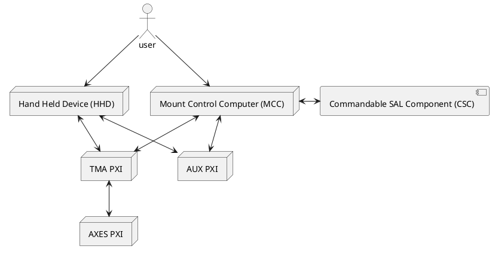
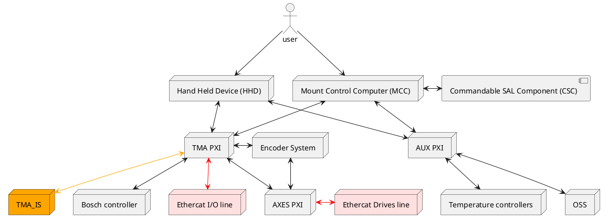
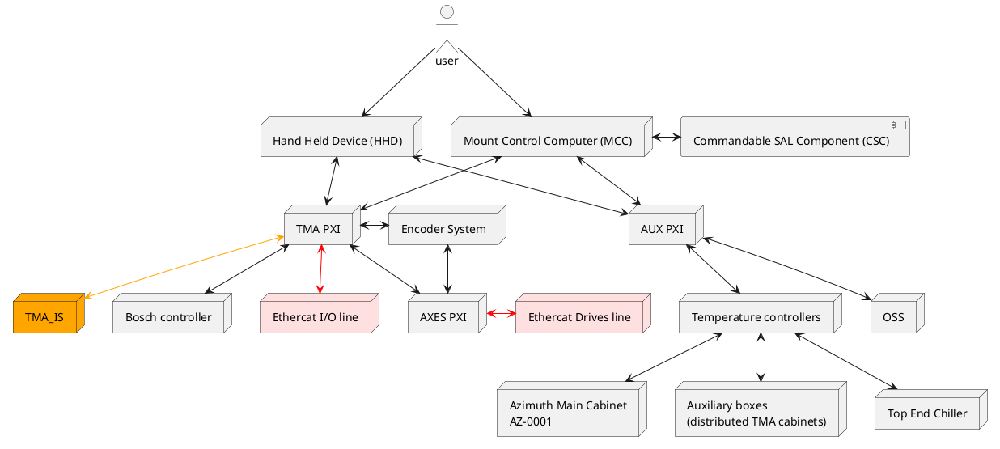
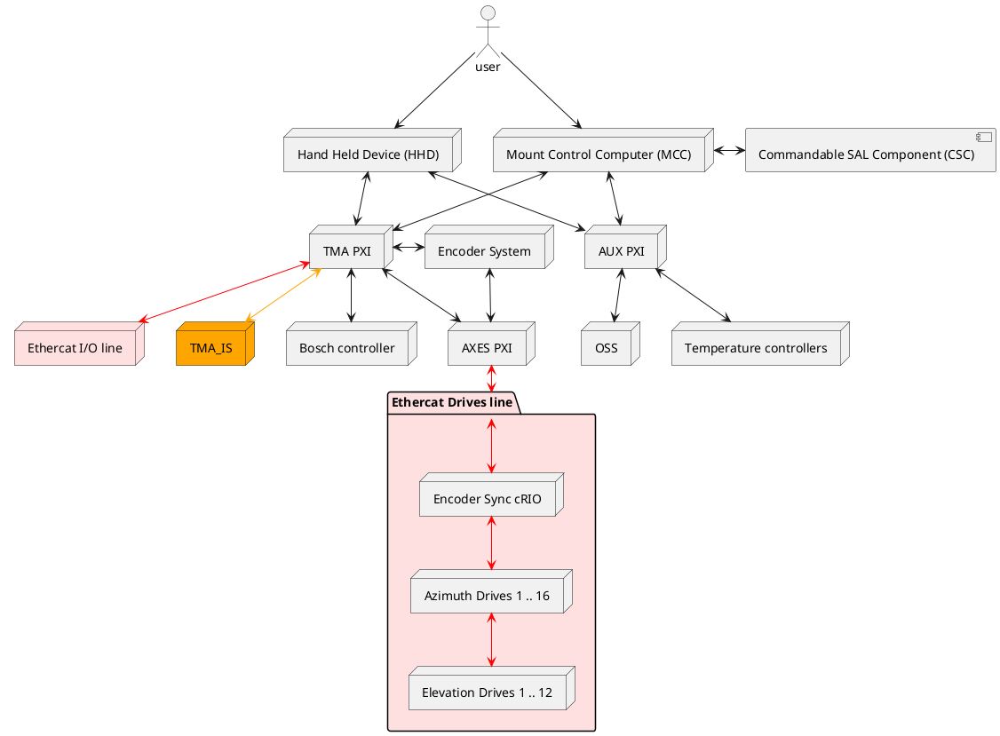
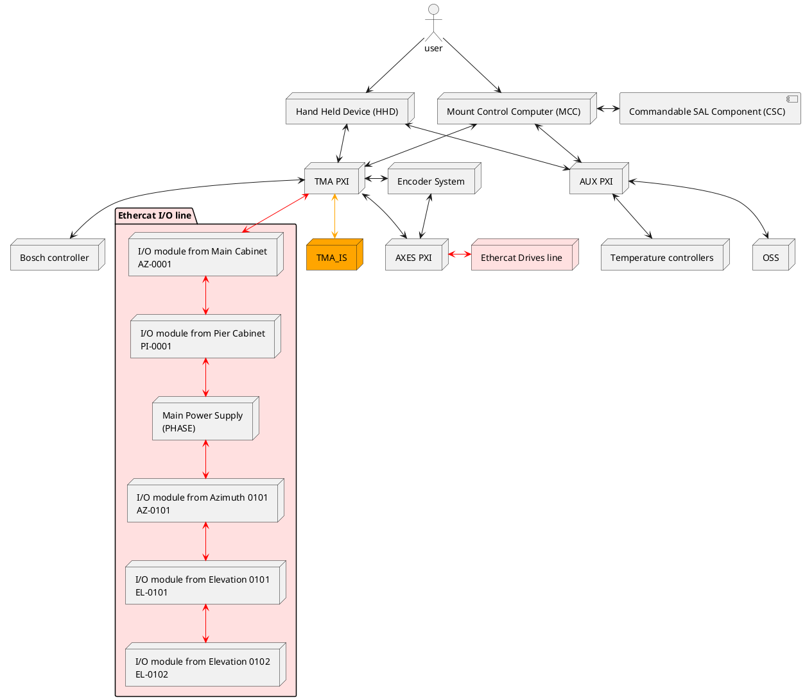
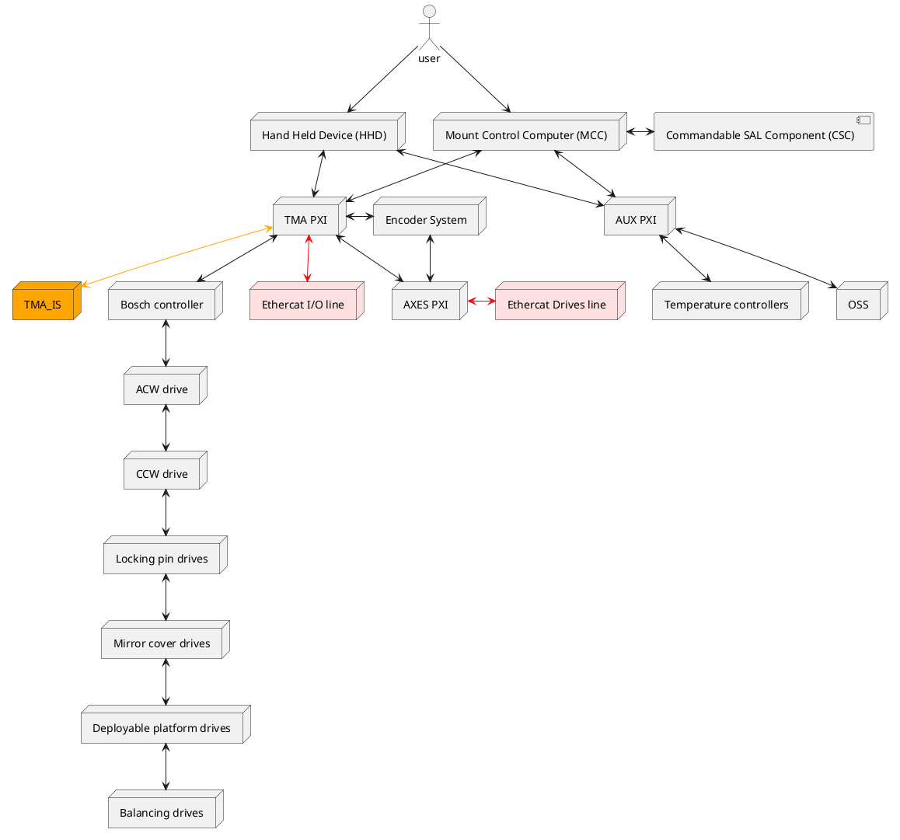
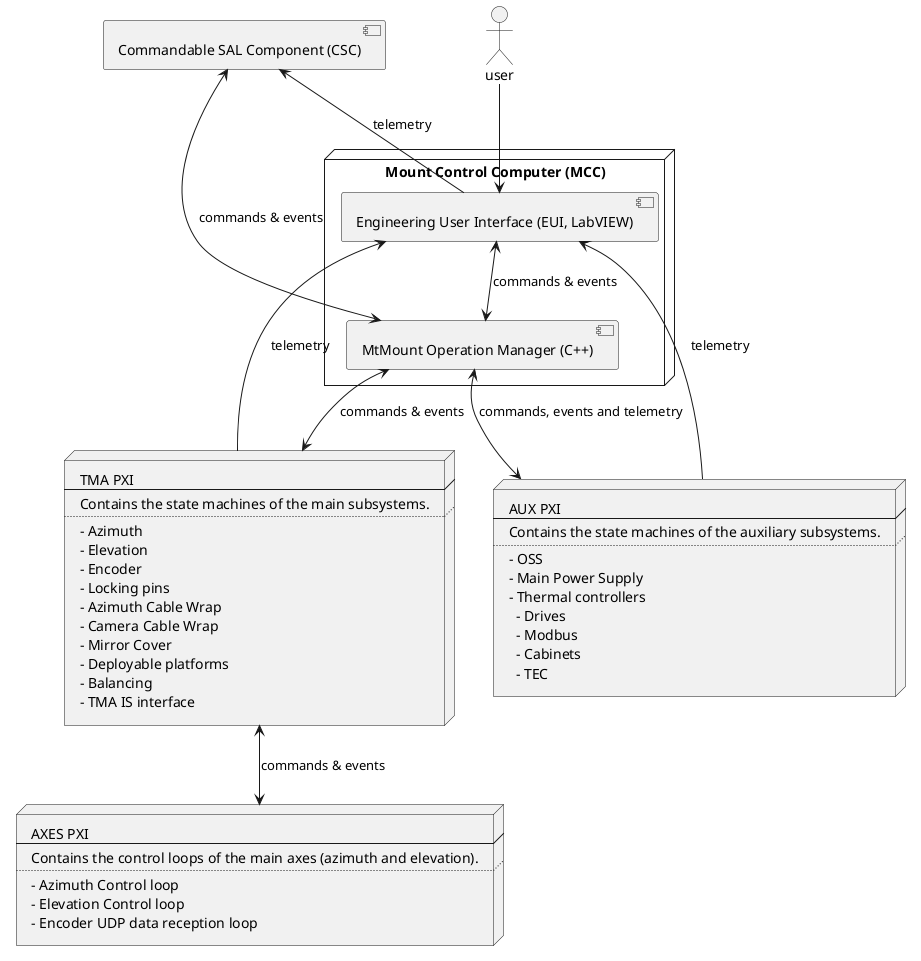

# Software and hardware structure diagrams

```plantuml
@startuml
actor user

component "Commandable SAL Component (CSC)" as CSC
node "Mount Control Computer (MCC)" as MCC
node "Hand Held Device (HHD)" as HHD

node "TMA PXI" as TMA_PXI
node "AUX PXI" as AUX_PXI
node "AXES PXI" as AXES_PXI

user --> MCC
user --> HHD

MCC <--> TMA_PXI
HHD <--> TMA_PXI

AUX_PXI <-u-> MCC
AUX_PXI <-u-> HHD
MCC <-r-> CSC

TMA_PXI <-d-> AXES_PXI

@enduml
```

```plantuml
@startuml
actor user

component "Commandable SAL Component (CSC)" as CSC
node "Mount Control Computer (MCC)" as MCC
node "Hand Held Device (HHD)" as HHD

node "TMA PXI" as TMA_PXI
node "AUX PXI" as AUX_PXI
node "AXES PXI" as AXES_PXI

node "Ethercat I/O line" as catIO #Implementation
node "Ethercat Drives line" as catDrives #Implementation

node TMA_IS #Orange
node "Encoder System" as EIB
node OSS
node "Temperature controllers" as temp
node "Bosch controller" as bosch

user --> MCC
user --> HHD

MCC <--> TMA_PXI
HHD <--> TMA_PXI

AUX_PXI <-u-> MCC
AUX_PXI <-u-> HHD
MCC <-r-> CSC

TMA_PXI <-d-> AXES_PXI
TMA_PXI <-[#red]-> catIO
TMA_PXI <-[#orange]-> TMA_IS
TMA_PXI <-r-> EIB
TMA_PXI <--> bosch

EIB <-d-> AXES_PXI
AXES_PXI <-r[#red]-> catDrives

AUX_PXI <--> OSS
AUX_PXI <--> temp

@enduml
```

```plantuml
@startuml
actor user

component "Commandable SAL Component (CSC)" as CSC
node "Mount Control Computer (MCC)" as MCC
node "Hand Held Device (HHD)" as HHD

node "TMA PXI" as TMA_PXI
node "AUX PXI" as AUX_PXI
node "AXES PXI" as AXES_PXI

node "Ethercat I/O line" as catIO #Implementation
node "Ethercat Drives line" as catDrives #Implementation

node TMA_IS #Orange
node "Encoder System" as EIB
node OSS
node "Temperature controllers" as temp
node "Bosch controller" as bosch
node "Azimuth Main Cabinet\nAZ-0001" as az0001
node "Auxiliary boxes\n(distributed TMA cabinets)" as auxBoxes
node "Top End Chiller" as tec

user --> MCC
user --> HHD

MCC <--> TMA_PXI
HHD <--> TMA_PXI

AUX_PXI <-u-> MCC
AUX_PXI <-u-> HHD
MCC <-r-> CSC

TMA_PXI <-d-> AXES_PXI
TMA_PXI <-[#red]-> catIO
TMA_PXI <-[#orange]-> TMA_IS
TMA_PXI <-r-> EIB
TMA_PXI <--> bosch

EIB <-d-> AXES_PXI
AXES_PXI <-r[#red]-> catDrives

AUX_PXI <--> OSS
AUX_PXI <--> temp

temp <--> az0001
temp <--> auxBoxes
temp <--> tec

@enduml
```

```plantuml
@startuml
actor user

component "Commandable SAL Component (CSC)" as CSC
node "Mount Control Computer (MCC)" as MCC
node "Hand Held Device (HHD)" as HHD

node "TMA PXI" as TMA_PXI
node "AUX PXI" as AUX_PXI
node "AXES PXI" as AXES_PXI

node "Ethercat I/O line" as catIO #Implementation

node TMA_IS #Orange
node "Encoder System" as EIB
node OSS
node "Temperature controllers" as temp
node "Bosch controller" as bosch

package "Ethercat Drives line" as catDrives #Implementation {
  node "Encoder Sync cRIO" as cRIO
  node "Azimuth Drives 1 .. 16" as azDrives
  node "Elevation Drives 1 .. 12" as elDrives
}

user --> MCC
user --> HHD

MCC <--> TMA_PXI
HHD <--> TMA_PXI

AUX_PXI <-u-> MCC
AUX_PXI <-u-> HHD
MCC <-r-> CSC

TMA_PXI <-d-> AXES_PXI
TMA_PXI <-[#red]-> catIO
TMA_PXI <-[#orange]-> TMA_IS
TMA_PXI <-r-> EIB
TMA_PXI <--> bosch

EIB <-d-> AXES_PXI
AXES_PXI <-[#red]-> catDrives

AUX_PXI <--> OSS
AUX_PXI <--> temp

catDrives <-d[#red]-> cRIO
cRIO <-[#red]-> azDrives
azDrives <-[#red]-> elDrives

@enduml
```

```plantuml
@startuml
actor user

component "Commandable SAL Component (CSC)" as CSC
node "Mount Control Computer (MCC)" as MCC
node "Hand Held Device (HHD)" as HHD

node "TMA PXI" as TMA_PXI
node "AUX PXI" as AUX_PXI
node "AXES PXI" as AXES_PXI

node "Ethercat Drives line" as catDrives #Implementation

node TMA_IS #Orange
node "Encoder System" as EIB
node OSS
node "Temperature controllers" as temp
node "Bosch controller" as bosch

package "Ethercat I/O line" as catIO #Implementation {
  node "I/O module from Main Cabinet\nAZ-0001" as azIO
  node "I/O module from Pier Cabinet\nPI-0001" as piIO
  node "Main Power Supply\n(PHASE)" as phase
  node "I/O module from Azimuth 0101\nAZ-0101" as az101IO
  node "I/O module from Elevation 0101\nEL-0101" as el101IO
  node "I/O module from Elevation 0102\nEL-0102" as el102IO
}

user --> MCC
user --> HHD

MCC <--> TMA_PXI
HHD <--> TMA_PXI

AUX_PXI <-u-> MCC
AUX_PXI <-u-> HHD
MCC <-r-> CSC

TMA_PXI <-d-> AXES_PXI
TMA_PXI <-[#orange]-> TMA_IS
TMA_PXI <-r-> EIB
TMA_PXI <--> bosch

EIB <-d-> AXES_PXI
AXES_PXI <-r[#red]-> catDrives

AUX_PXI <--> OSS
AUX_PXI <--> temp

TMA_PXI <-[#red]-> azIO
azIO <-[#red]-> piIO
piIO <-[#red]-> phase
phase <-[#red]-> az101IO
az101IO <-[#red]-> el101IO
el101IO <-[#red]-> el102IO
@enduml
```

```plantuml
@startuml
actor user

component "Commandable SAL Component (CSC)" as CSC
node "Mount Control Computer (MCC)" as MCC
node "Hand Held Device (HHD)" as HHD

node "TMA PXI" as TMA_PXI
node "AUX PXI" as AUX_PXI
node "AXES PXI" as AXES_PXI

node "Ethercat I/O line" as catIO #Implementation
node "Ethercat Drives line" as catDrives #Implementation

node TMA_IS #Orange
node "Encoder System" as EIB
node OSS
node "Temperature controllers" as temp
node "Bosch controller" as bosch
node "ACW drive" as acw
node "CCW drive" as ccw
node "Locking pin drives" as lp
node "Mirror cover drives" as mc
node "Deployable platform drives" as dp
node "Balancing drives" as bal

user --> MCC
user --> HHD

MCC <--> TMA_PXI
HHD <--> TMA_PXI

AUX_PXI <-u-> MCC
AUX_PXI <-u-> HHD
MCC <-r-> CSC

TMA_PXI <-d-> AXES_PXI
TMA_PXI <-[#red]-> catIO
TMA_PXI <-[#orange]-> TMA_IS
TMA_PXI <-r-> EIB
TMA_PXI <--> bosch

EIB <-d-> AXES_PXI
AXES_PXI <-r[#red]-> catDrives

AUX_PXI <--> OSS
AUX_PXI <--> temp

bosch <--> acw
acw <--> ccw
ccw <--> lp
lp <--> mc
mc <--> dp
dp <--> bal
@enduml
```

```plantuml
@startuml
actor user

component "Commandable SAL Component (CSC)" as CSC
node "Mount Control Computer (MCC)" {
  component EUI [
  Engineering User Interface (EUI, LabVIEW)]
  component Cpp [
  MtMount Operation Manager (C++)]
}

node TMA_PXI [
  TMA PXI
  --
  Contains the state machines of the main subsystems.
  ..
  - Azimuth
  - Elevation
  - Encoder
  - Locking pins
  - Azimuth Cable Wrap
  - Camera Cable Wrap
  - Mirror Cover
  - Deployable platforms
  - Balancing
  - TMA IS interface
]
node AUX_PXI [
  AUX PXI
  --
  Contains the state machines of the auxiliary subsystems.
  ..
  - OSS
  - Main Power Supply
  - Thermal controllers
    - Drives
    - Modbus
    - Cabinets
    - TEC
]
node AXES_PXI[
  AXES PXI
  --
  Contains the control loops of the main axes (azimuth and elevation).
  ..
  - Azimuth Control loop
  - Elevation Control loop
  - Encoder UDP data reception loop
]

EUI <--> Cpp: commands & events
user --> EUI
Cpp <--> TMA_PXI: commands & events
TMA_PXI <-d-> AXES_PXI: commands & events
Cpp <-d-> AUX_PXI: commands, events and telemetry
TMA_PXI -u-> EUI: telemetry
AUX_PXI -u-> EUI: telemetry
EUI -u-> CSC: telemetry
Cpp <-u-> CSC: commands & events
@enduml
```
